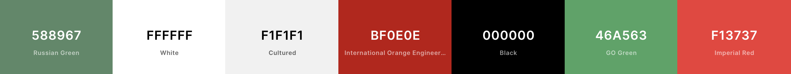

# Milestone Project 3 - Ciao Down
View live project <a href=“https://ciao-down.herokuapp.com/”>here</a>

Ciao Down is a free to use online cookbook app focused on Italian cuisine, that presents the user with recipes that have been shared on the
site. The user is able to create a free account. Doing so give them the ability to add their own recipes to the site, edit those
recipes, and delete those recipes if wanted.

***
## Table of Contents:
* [What does it do and what does it need to fulfill?](#what-does-it-do-and-what-does-it-need-to-fulfill)
* [User Experience](#user-experience)
   * [User Stories](#user-stories)
   * [Design](#design)
       * [1. Colour Scheme](#1-color-scheme)
       * [2. Font](#2-font)
       * [3. Logo](#3-logo)
       * [4. Geometry](#4-geometry)
       * [5. Wireframes](#5-wireframes)
* [Technologies Used](#technologies-used)
* [Features](#features)
   * [Existing Features](#future-features)
   * [Future Features](#removed-features)
* [Testing](#testing)
* [Deployment](#deployment)
    * [Hosting on Github Pages](#hosting-on-github-pages)
    * [Running Project Locally](#running-project-locally)
* [Credits](#credits)
    * [Content](#content)
    * [Code](#code)
    * [Media](#media)
* [Acknowledgements](#acknowledgements)
* [Special Thanks](#special-thanks)
* [Disclaimer](#disclaimer)
***

## 

### Ciao Down Logo

Fun Fact?!

Ciao Down originated from a pun. 'Chow Down', means to eat down and enjoy one's food. This was morphed with the Italian word 'Ciao' to give the site the feel of Italian cuisine.

***

## **What does it do and what does it need to fulfill?**
This is my third milestone project where I have designed, created and built a fully Mobile Responsive CRUD Web Application for users to
store and share recipes. The project was built  with HTML, CSS, JavaScript, jQuery, Python, Flask, and MongoDB. The Materialize Framework was
used along side these programming languages to help give the site a clear strucutre and ensure the site is as responsive as possible for use
across various screen sizes, including desktop, tablet and mobile.
Users will be able to register, see their profile, log out and log back in again. Registered users will be able to add new recipes, and use
a toggle switch to show if a recipe is Gluten Free or Vegetarian. Registered users will be able to edit and delete their own recipes. 

My goal was to create a recipe site where users could easily browse Italian cuisine and access clear and concise recipes. Many of the
recipe websites that I came across during my research required the user to scroll through lots of content before finding their desired
recipe. I felt this kind of design was too busy and could easily overwhelm the user. In order to enhance user experience, it was important
to me that the recipe pages on 'Ciao Down' displayed information (e.g: ingredients, method and dietary requirements) in a simple and
easy-to-digest manner. The target audience for this application is anyone who has an interest or passion for Italian food, not matter what
their age or experience.

## **User Experience**

#### User Stories:

* Generic User:

    * As a user, I want to be able to navigate through the entire site, comfortably and securely.
    * As a user, I want to be able to easily search for recipes by name or ingredients.
    * As a user, I want to view the contents of recipes on the site.
    * As a user, I want to have the possibility of printing a recipe.
    * As a user, I want to be able to register/sign-up and create my own account on the site.

* Registered User:

    * As a registered user, I want to be able to easily log in to my account.
    * As a registered user, I want to be able to create and submit my own recipes to the site.
    * As a registered user, I want to be able to see my own recipes in one place.
    * As a registered user, I want to be able to easily edit my own recipes.
    * As a registered user, I want to be able to easily delete my own recipes.
    * As a registered user, I want to be able to add ingredients from a recipe to my shopping list in my profile.
    * As a registered user, I want to be able to easily edit my shopping list.
    * As a registered user, I want to be able to print my own shopping list.
    * As a registered user, I want to be able to easily log out of my account.

* Site admin:

    * As the site admin, I want to be able to do all that is possible for a generic user and registered user.
    * As the site admin, I want to be able to access ALL recipes on the site, having the abilitly to edit any errors found, and delete
    recipes in case of unsuitable content.
    * As the site admin, I want to be able to add new categories to the site as the site expands.
    * As the site admin, I want to be able to edit and remove categories as I see fit for user experience.

[Back to Top](#table-of-contents)

#### Design
##### 1. Colour Scheme

The colour scheme used for this site was to be colourful and eyecatching, but also not overwhelming to the user. In order to keep the theme of my site clear, I decided to base my colour scheme on the Italian flag. I used [Coolors](https://coolors.co/) to start playing with
variations of green and red. It was important to me that the colour scheme didn't make the page feel to busy and cluttered, as the content of the site would be very colourful.

The colours I used are:

The primary colour, Russian Green, was used for the navigation bar, buttons of forms and the back to top button, and some text on the recipe page for clearer contrast. I toned down the green to a slightly more muted shade that wasnt too garish, and easy on the eye and comforting for the user. It also worked well as the content of the page was going to be predominently colourful. Using the colour tool that appears when hovering over a colour set in the style.css page, I made the green a bit more bold for use as the colour of success flash messages, so it stood out clear to the user from the navbar. This colour was the GO Green.

I chose the background colour to be White, so that the colourful content of the page would be easily seen, and gave a clean break between areas of the pages. I was hesitant of using a white background as feedback from my Milestone Project 1 was about having text on a white background. I chose the white as I was wanting to use the Italian flag as my colour scheme, but also a lot of the sites I found when researching for this project used white backgrounds. 

The hamburger and home icons as well as the Log In/Sign Up/Logout text in the navbar looked cleaner as white text.

The red, International Orange Engineering was a bright colour and picked as an accent to contrast well with the white and green, breaking the page up, clearly defining the different sections of the page. Also completing my Italian flag design. It was used as the footer colour, and incorporated with the social icons that turned white on hover and the icon itself red, giving a very clear contrast for user experience. I also used the method of the colour tool mentioned above to get a brighter red to use as the error colour of flash messages, to really indicate the error to the user. This colour was the Imperial Red.

As mentioned above, receiving critcism of text on a white background, I gave the forms the background colour of Cultured. This gave a clear definition of the form itself, making it clear that this was the content, and keeping it user friendly. I discovered this colour using the tool as mentioned before, getting the right shade I wanted.

For text across the site, for the most part I used Black, to make sure all the words were clear and easy to read.

##### 2. Font

I found fonts from researching online cookbook reccomendations, and scouring [Google Fonts](https://fonts.google.com/), using their inbuilt compare tool. I decided to use two fonts throughout my site. I wanted the main and secondary fonts to complement each other well throughout the site.
The font for the body text was 'Source Sans Pro', which was a clean and easy to read font across all areas it was presented. I found this font bold and to the point, and stood out clearly when used as an overlay to images.The second font I used was 'Average'. This was not average as it's name may suggest. It was a Serif font that gave a bold statement when being used for headers and titles, that this was a statement. 
These fonts were included in the site by inserting an _import_ link of the Google Fonts API into the top of my style.css file. Both of the fonts had a fall back of 'Sans-serif', should the site not load the import correctly. 

##### 3. Logo

The logo was created using an online design tool called [Canva](https://www.canva.com/en_gb/). I started by creating a custom canvas to suit my required dimensions, and then set the background to the colour, Russian Green, so it would blend with the nav bar. I played with several combinations of hand written and block fonts until I found a combiation I was happy with. I wanted the two words to be in contrasting fonts. I then played with positioning to make it look more exciting, and then completed it with an underlying Italian flag. 

##### 4. Composition

There is a clear structure throughout the site. Each page had a fixed navbar and footer that was consistent and the ease of navigation across the site was enhanced further with back buttons and call to action buttons. A side nav was used to house the nav links to keep the site clean and keep the user interacting with the site, but not to the point of confusing the user. Content hinting was used on the home page to encourage the user to scroll down the page. A bact to top button also aided ease of use for the user once they had scrolled down, to avoid having to scroll all the way back to the top to find the navigation.I used containers across the pages to keep good margins and to avoid ay content being lost of the screen. Images were displayed in grids for clear and clean design for the user, and the use of an accordion on the users profile page kept text nicely bundled together in their own compartments.

##### 5. Wireframes

Having researched and thought over the design process thoroughly, I created a workspace on [Figma](https://www.figma.com/). I had initially sketched ideas onto paper, so now I could start to bring them to life. I created all the pages I had planned for desktop and mobile screen sizes, clearly showing how the structure of the content would mould together on the different sizes, creating more enhanced wireframes.

Wireframes

* Home Page
    * [Desktop View](https://github.com/Gregory4321/ciao-down/blob/master/static/readme_images/wireframes/home-wire.png)
    * [Mobile View](https://github.com/Gregory4321/ciao-down/blob/master/static/readme_images/wireframes/mob-home-wire.png)
* Recipe Page
    * [Desktop View](https://github.com/Gregory4321/ciao-down/blob/master/static/readme_images/wireframes/recipe-wire.png)
    * [Mobile View](https://github.com/Gregory4321/ciao-down/blob/master/static/readme_images/wireframes/mob-recipe-wire.png)
* Profile Page
    * [Desktop View](https://github.com/Gregory4321/ciao-down/blob/master/static/readme_images/wireframes/profile-wire.png)
    * [Mobile View](https://github.com/Gregory4321/ciao-down/blob/master/static/readme_images/wireframes/mob-profile-wire.png)
* Add Recipe Page
    * [Desktop View](https://github.com/Gregory4321/ciao-down/blob/master/static/readme_images/wireframes/add-wire.png)
    * [Mobile View](https://github.com/Gregory4321/ciao-down/blob/master/static/readme_images/wireframes/mob-add-wire.png)
* Edit Recipe Page
    * [Desktop View](https://github.com/Gregory4321/ciao-down/blob/master/static/readme_images/wireframes/edit-wire.png)
    * [Mobile View](https://github.com/Gregory4321/ciao-down/blob/master/static/readme_images/wireframes/mob-edit-wire.png)
* Login Page
    * [Desktop View](https://github.com/Gregory4321/ciao-down/blob/master/static/readme_images/wireframes/login-wire.png)
    * [Mobile View](https://github.com/Gregory4321/ciao-down/blob/master/static/readme_images/wireframes/mob-login-wire.png)
* Registration Page
    * [Desktop View](https://github.com/Gregory4321/ciao-down/blob/master/static/readme_images/wireframes/register-wire.png)
    * [Mobile View](https://github.com/Gregory4321/ciao-down/blob/master/static/readme_images/wireframes/mob-register-wire.png)

[Back to Top](#table-of-contents)

They also have the ability to add the ingredients list from a recipe to a shopping list hosted
within their own profile.